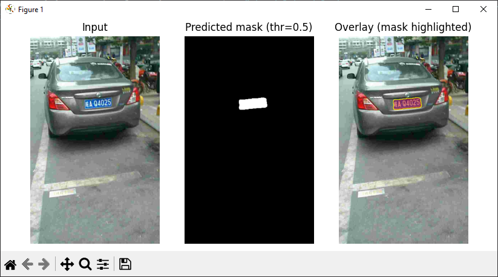
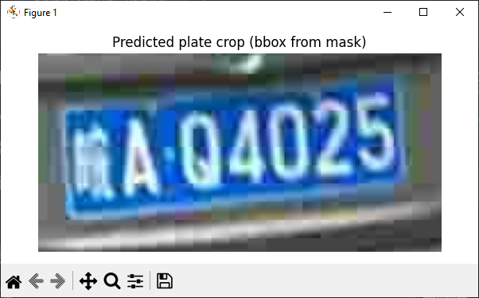
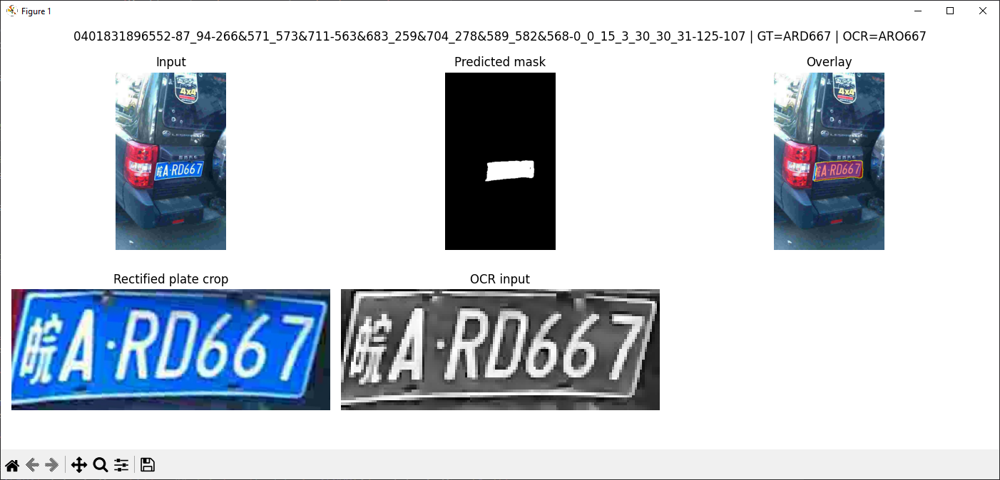

# Applied Deep Learning Project

- **Student**: Balázs Róna
- **Project Type**: Bring Your Own Method
- **Python Version**: 3.12.0

---

## 1. References

1. Zherzdev, S., & Gruzdev, A. (2018). *LPRNet: License Plate Recognition via Deep Neural Networks*. [arXiv:1806.10447](https://arxiv.org/abs/1806.10447)
2. Laroca, R., Severo, E., Zanlorensi, L. A., Oliveira, L. S., Gonçalves, G. R., Schwartz, W. R., & Menotti, D. (2018). *A Robust Real-Time Automatic License Plate Recognition Based on the YOLO Detector*. [arXiv:1802.09567](https://arxiv.org/abs/1802.09567)

---

## 2. Topic

Automatic License Plate Segmentation and Recognition using Deep Neural Networks

---

## 3. Project Type: Bring Your Own Method

I will re-implement and modify a license plate detection and segmentation model (such as a U-Net or YOLOv8 segmentation head) and combine it with post-processing and OCR for end-to-end license plate reading.

---

## 4. Summary

### 4.1 Description

The goal is to build an end-to-end system for license plate recognition:

1. **Segment** license plates from real life images using a deep learning model.
2. **Post-process** the segmented region using image enhancement techniques (grayscale normalization, contrast stretching, thresholding).
3. **Extract text** from the enhanced region using a pre-trained OCR model (such as EasyOCR or Tesseract).

My approach is a modular deep-learning pipeline that focuses on accurate segmentation, since OCR performance is highly dependent on clean plate crops. Possible improvements include experimenting with segmentation models and better pre-/post-processing techniques.

---

### 4.2 Dataset

I plan to use the OpenALPR Benchmark Dataset or CCPD (Chinese City Parking Dataset), both of which are publicly available.

**Dataset characteristics:**

- ~200k images (CCPD)
- Bounding boxes or segmentation masks for plates
- Diverse illumination, angles, and backgrounds

---

### 4.3 Work-Breakdown Plan

| Task                                  | Description                                                                                              | Estimated Time |
| ------------------------------------- | -------------------------------------------------------------------------------------------------------- | -------------- |
| **1. Dataset Setup & Exploration**    | Download and inspect dataset, preprocess (resize, normalization, train/test split)                       | 5 h            |
| **2. Model Design & Implementation**  | Choose baseline (U-Net or YOLOv8-Seg), modify architecture (e.g., add attention or dropout improvements) | 10 h           |
| **3. Training & Fine-Tuning**         | Train on subset of dataset, tune hyperparameters, evaluate segmentation accuracy                         | 12 h           |
| **4. OCR Integration**                | Integrate pre-trained OCR model and connect to segmentation output                                       | 5 h            |
| **5. Post-Processing Pipeline**       | Image enhancement, thresholding, resizing for OCR                                                        | 3 h            |
| **6. Application / Demo Development** | Build small Python app to demonstrate full pipeline                                                      | 5 h            |
| **7. Final Report Writing**           | Document methods, results, and comparison with literature                                                | 6 h            |
| **8. Presentation Preparation**       | Prepare slides and demo for final presentation                                                           | 4 h            |

---

### 4.4 Expected Outcome

- A trained segmentation model capable of accurately detecting license plates.
- A working end-to-end pipeline combining segmentation, post-processing, and OCR.
- Evaluation of segmentation performance and OCR accuracy.
- A short demo of the system on test images.

---

## 5. Success Criteria & Metrics

**Success is achieved if:**

1. The improved model shows $\ge+3$ pp mIoU and $\ge +5$ pp exact-match OCR accuracy over the baseline.
2. Model latency increases by no more than $20\%$ compared to baseline.
3. Ablation studies demonstrate measurable effects of architectural and training modifications.

---

### 5.1. Evaluation Metrics

| Stage                       | Metric                             | Description / Goal                                                |
| --------------------------- | ---------------------------------- | ----------------------------------------------------------------- |
| Segmentation                | Mean IoU (mIoU)                    | Main accuracy measure for plate mask overlap, target $\ge 0.85$   |
|                             | Dice Coefficient (F1)              | Pixel-wise precision/recall balance, target $\ge 0.90$            |
| OCR / End-to-End            | Exact Match Rate (EMR)             | % of plates with perfectly recognized text, target $\ge 80\%$     |
|                             | Character-Level Accuracy (CLA)     | Average per-character correctness (1 - normalized Levenshtein)    |
| Robustness & Efficiency     | Condition robustness               | EMR drop $\le 10$ pp across day/night or angle changes            |
|                             | Latency / Throughput               | $\le 20$ ms per image ($640 \times 384$ on GPU)                   |
|                             | Model Size / FLOPs                 | $\le 10$ M parameters or $\le 40$ GFLOPs                          |

---

### 5.2. Baseline vs. Improvements

- **Baseline A:** Small U-Net (BCE + Dice loss) with standard augmentations.
- **Improved B:** Add channel/spatial attention (SE / CBAM), dilated bottleneck, or FPN-style skip.
- **Improved C:** Focal + Dice loss, perspective rectification, and OCR pre-processing variants.

Each improvement will be validated through controlled ablations showing metric gains or efficiency trade-offs.

---

### 5.3. Experimental Plan

| Aspect            | Variations Tested                   | Metric(s)             |
| ----------------- | ----------------------------------- | --------------------- |
| Loss function     | BCE + Dice vs Focal + Dice          | mIoU, Dice            |
| Attention block   | None / SE / CBAM                    | mIoU, params, latency |
| Upsampling        | Transposed Conv / Bilinear + 1x1    | mIoU, latency         |
| OCR preprocessing | CLAHE / +Threshold / +Rectification | EMR, CLA              |
| Resolution        | 512 / 640 / 768 short side          | mIoU, latency         |

---

### 5.4. Reporting

- Quantitative results: mIoU, Dice, EMR, CLA, latency, params/FLOPs.
- Qualitative results: visual mask overlays and OCR outputs (success / failure cases).
- All metrics computed on a fixed held-out validation split for reproducibility.

---

## 6. Usage

I have implemented command-line interfaces for training segmentation models, evaluating checkpoints, and running end-to-end OCR experiments.

### 6.1 Training and Testing Segmentation Models (`main.py`)

The main entry point supports training from scratch, resuming from a checkpoint, and testing a trained model.

#### Train a new model from scratch

```bash
python src/main.py train \
  --data CCPD \
  --epochs 25 \
  --attention cbam \
  --out checkpoints/cbam_last.pth
```

#### Resume training from a checkpoint

```bash
python src/main.py resume \
  --data CCPD \
  --ckpt checkpoints/cbam_last.pth \
  --epochs 40 \
  --attention cbam
```

#### Evaluate a checkpoint on the test set

```bash
python src/main.py test \
  --data CCPD \
  --ckpt checkpoints/cbam_last.pth \
  --attention cbam
```

Supported attention modes:

- `none` (baseline U-Net)
- `se` (Squeeze-and-Excitation)
- `cbam` (Convolutional Block Attention Module)

---

### 6.2 Single-Image Evaluation (`eval_one_image.py`)

Run inference on a single image and visualize the segmentation result.

```bash
python src/eval_one_image.py \
  --ckpt checkpoints/best_cbam.pth \
  --image path/to/image.jpg \
  --model cbam \
  --thr 0.5
```

This script displays:

- Original image
- Predicted segmentation mask
- Overlay highlighting the segmented license plate
- Cropped plate region derived from the mask




---

### 6.3 End-to-End OCR Evaluation (`eval_ocr.py`)

Evaluate the full pipeline: segmentation -> post-processing -> EasyOCR -> comparison with ground truth encoded in the image filename.

```bash
python src/eval_ocr.py \
  --data CCPD \
  --ckpt checkpoints/best_cbam.pth \
  --attention cbam \
  --split test.txt \
  --langs en \
  --show
```

Options:

- `--show` enables per-image debug visualizations (segmentation, rectified crop, OCR input).
- OCR accuracy is reported using:
  - Exact Match Rate (EMR)
  - Character-Level Accuracy (CLA) based on normalized Levenshtein distance.



---

## 7. Model Comparison

The following table summarizes the performance of the best models evaluated on the test set.

| Model Variant  | Attention | Train Loss | Test Loss | Mean IoU   |
| -------------- | --------- | ---------- | --------- | ---------- |
| **Baseline**   | None      | 0.5508     | 0.1245    | 0.7423     |
| **SE Model**   | SE        | 0.3910     | 0.0988    | 0.7418     |
| **CBAM Model** | CBAM      | 0.8041     | 0.1033    | 0.8111     |

### Observations

- CBAM significantly improves segmentation quality by combining channel and spatial attention, achieving the highest IoU.
- SE attention improves generalization with minimal overhead but does not outperform the baseline in IoU.
- The baseline U-Net already provides a strong foundation, validating the effectiveness of the chosen architecture and training setup.

---

## 8. OCR Evaluation Results

I have conducted an end-to-end OCR evaluation using the best-performing segmentation model (CBAM) combined with EasyOCR and the proposed post-processing pipeline.

### Results

| Metric                         | Value      |
| ------------------------------ | ---------- |
| Exact Match Rate (EMR)         | 29.6%      |
| Character-Level Accuracy (CLA) | 74.77%     |

### Discussion

While the exact match rate remains relatively low, the character-level accuracy indicates that the OCR system often predicts partially correct plate strings. Most errors are attributable to:

- Character confusions caused by chinese symbols.
- Blurred or low quality images.
- Variations in illumination and perspective not fully handled by the OCR model.

These results show that segmentation quality alone is not sufficient for reliable end-to-end license plate recognition. Further gains are expected from OCR-specific improvements.
